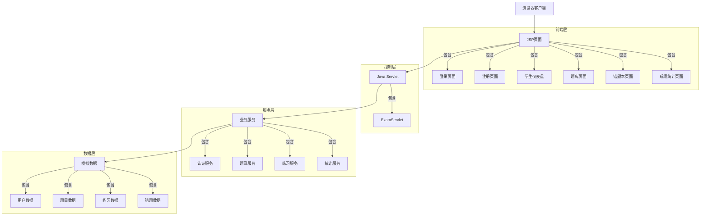
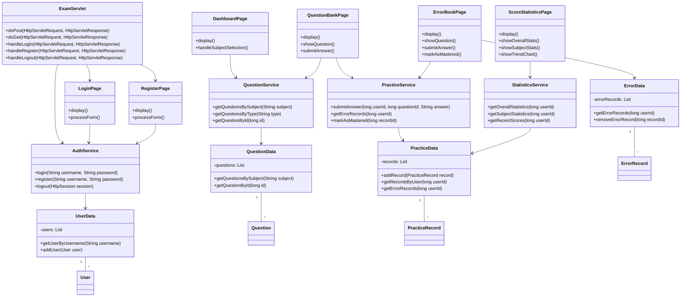
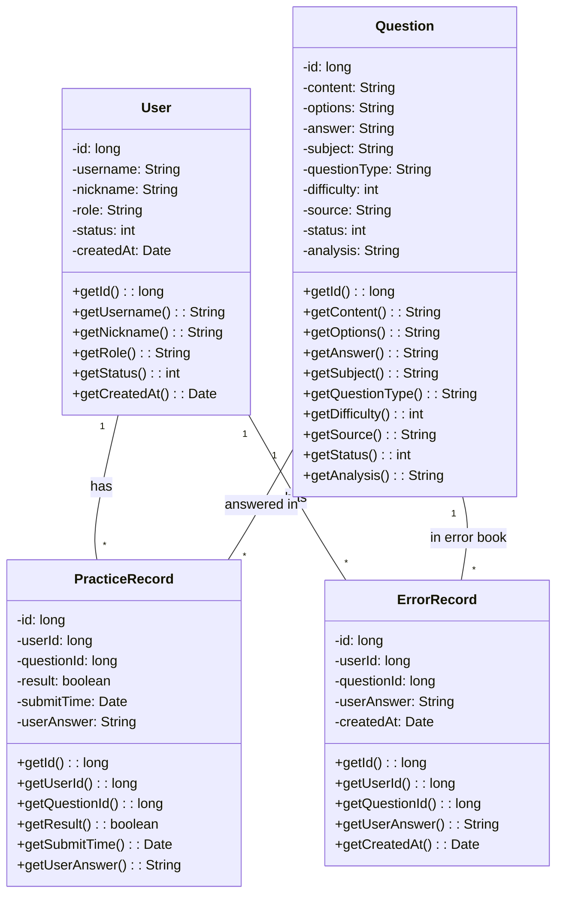
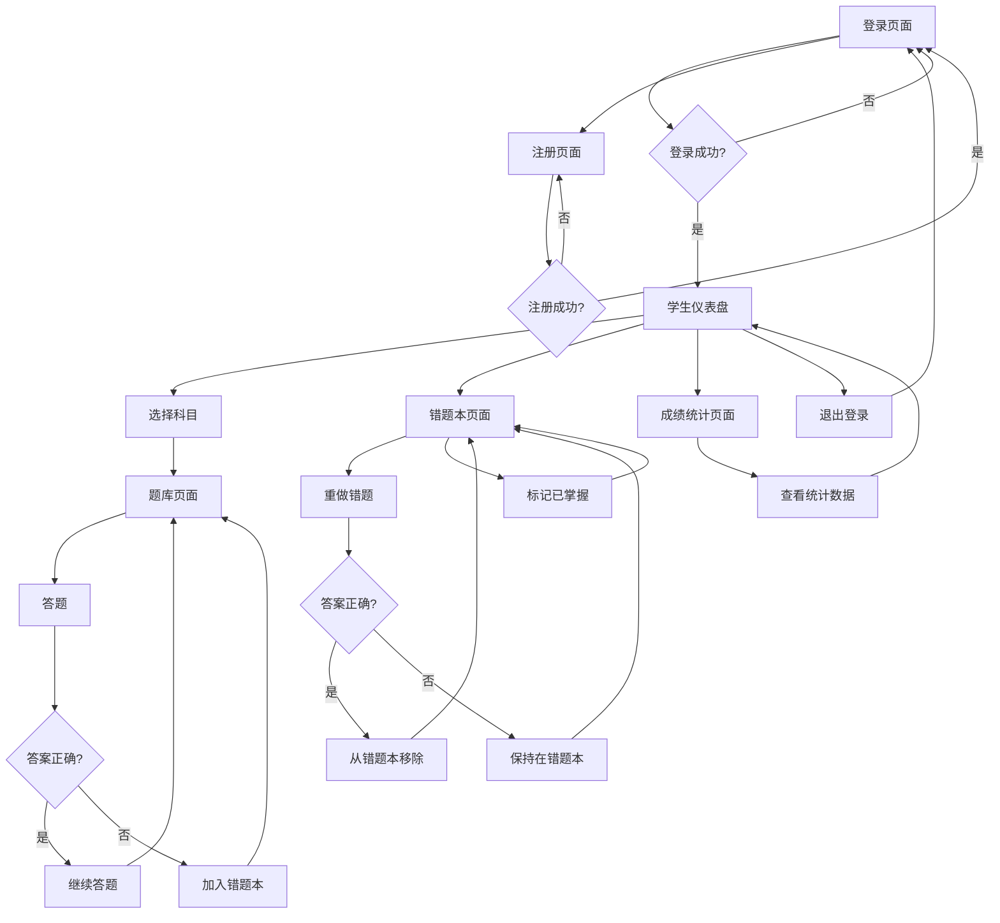

# 408考研刷题系统（Java JSP版本）类图

## 系统架构

```mermaid
flowchart TD
    Client[浏览器客户端] --> JSP[JSP页面]
    JSP --> Servlet[Java Servlet]
    Servlet --> Service[业务服务]
    Service --> Data[模拟数据]
    
    subgraph 前端层
        JSP -- 包含 --> LoginPage[登录页面]
        JSP -- 包含 --> RegisterPage[注册页面]
        JSP -- 包含 --> DashboardPage[学生仪表盘]
        JSP -- 包含 --> QuestionBankPage[题库页面]
        JSP -- 包含 --> ErrorBookPage[错题本页面]
        JSP -- 包含 --> ScoreStatisticsPage[成绩统计页面]
    end
    
    subgraph 控制层
        Servlet -- 包含 --> ExamServlet[ExamServlet]
    end
    
    subgraph 服务层
        Service -- 包含 --> AuthService[认证服务]
        Service -- 包含 --> QuestionService[题目服务]
        Service -- 包含 --> PracticeService[练习服务]
        Service -- 包含 --> StatisticsService[统计服务]
    end
    
    subgraph 数据层
        Data -- 包含 --> UserData[用户数据]
        Data -- 包含 --> QuestionData[题目数据]
        Data -- 包含 --> PracticeData[练习数据]
        Data -- 包含 --> ErrorData[错题数据]
    end
```

## 类关系图

```mermaid
classDiagram
    class ExamServlet {
        +doPost(HttpServletRequest, HttpServletResponse)
        +doGet(HttpServletRequest, HttpServletResponse)
        +handleLogin(HttpServletRequest, HttpServletResponse)
        +handleRegister(HttpServletRequest, HttpServletResponse)
        +handleLogout(HttpServletRequest, HttpServletResponse)
    }
    
    class LoginPage {
        +display()
        +processForm()
    }
    
    class RegisterPage {
        +display()
        +processForm()
    }
    
    class DashboardPage {
        +display()
        +handleSubjectSelection()
    }
    
    class QuestionBankPage {
        +display()
        +showQuestion()
        +submitAnswer()
    }
    
    class ErrorBookPage {
        +display()
        +showQuestion()
        +submitAnswer()
        +markAsMastered()
    }
    
    class ScoreStatisticsPage {
        +display()
        +showOverallStats()
        +showSubjectStats()
        +showTrendChart()
    }
    
    class AuthService {
        +login(String username, String password)
        +register(String username, String password)
        +logout(HttpSession session)
    }
    
    class QuestionService {
        +getQuestionsBySubject(String subject)
        +getQuestionsByType(String type)
        +getQuestionById(long id)
    }
    
    class PracticeService {
        +submitAnswer(long userId, long questionId, String answer)
        +getErrorRecords(long userId)
        +markAsMastered(long recordId)
    }
    
    class StatisticsService {
        +getOverallStatistics(long userId)
        +getSubjectStatistics(long userId)
        +getRecentScores(long userId)
    }
    
    class UserData {
        -users: List<User>
        +getUserByUsername(String username)
        +addUser(User user)
    }
    
    class QuestionData {
        -questions: List<Question>
        +getQuestionsBySubject(String subject)
        +getQuestionById(long id)
    }
    
    class PracticeData {
        -records: List<PracticeRecord>
        +addRecord(PracticeRecord record)
        +getRecordsByUser(long userId)
        +getErrorRecords(long userId)
    }
    
    class ErrorData {
        -errorRecords: List<ErrorRecord>
        +getErrorRecords(long userId)
        +removeErrorRecord(long recordId)
    }
    
    ExamServlet --> AuthService
    ExamServlet --> LoginPage
    ExamServlet --> RegisterPage
    
    LoginPage --> AuthService
    RegisterPage --> AuthService
    
    DashboardPage --> QuestionService
    QuestionBankPage --> QuestionService
    QuestionBankPage --> PracticeService
    
    ErrorBookPage --> PracticeService
    ErrorBookPage --> ErrorData
    
    ScoreStatisticsPage --> StatisticsService
    
    AuthService --> UserData
    QuestionService --> QuestionData
    PracticeService --> PracticeData
    StatisticsService --> PracticeData
    
    UserData "1" -- "*" User
    QuestionData "1" -- "*" Question
    PracticeData "1" -- "*" PracticeRecord
    ErrorData "1" -- "*" ErrorRecord
```

## 数据模型类图

```mermaid
classDiagram
    class User {
        -id: long
        -username: String
        -nickname: String
        -role: String
        -status: int
        -createdAt: Date
        +getId(): long
        +getUsername(): String
        +getNickname(): String
        +getRole(): String
        +getStatus(): int
        +getCreatedAt(): Date
    }
    
    class Question {
        -id: long
        -content: String
        -options: String
        -answer: String
        -subject: String
        -questionType: String
        -difficulty: int
        -source: String
        -status: int
        -analysis: String
        +getId(): long
        +getContent(): String
        +getOptions(): String
        +getAnswer(): String
        +getSubject(): String
        +getQuestionType(): String
        +getDifficulty(): int
        +getSource(): String
        +getStatus(): int
        +getAnalysis(): String
    }
    
    class PracticeRecord {
        -id: long
        -userId: long
        -questionId: long
        -result: boolean
        -submitTime: Date
        -userAnswer: String
        +getId(): long
        +getUserId(): long
        +getQuestionId(): long
        +getResult(): boolean
        +getSubmitTime(): Date
        +getUserAnswer(): String
    }
    
    class ErrorRecord {
        -id: long
        -userId: long
        -questionId: long
        -userAnswer: String
        -createdAt: Date
        +getId(): long
        +getUserId(): long
        +getQuestionId(): long
        +getUserAnswer(): String
        +getCreatedAt(): Date
    }
    
    User "1" -- "*" PracticeRecord: has
    User "1" -- "*" ErrorRecord: has
    Question "1" -- "*" PracticeRecord: answered in
    Question "1" -- "*" ErrorRecord: in error book
```

## 页面流程图

```mermaid
flowchart TD
    A[登录页面] --> B{登录成功?}
    B -->|是| C[学生仪表盘]
    B -->|否| A
    A --> D[注册页面]
    D --> E{注册成功?}
    E -->|是| A
    E -->|否| D
    
    C --> F[选择科目]
    F --> G[题库页面]
    G --> H[答题]
    H --> I{答案正确?}
    I -->|是| J[继续答题]
    I -->|否| K[加入错题本]
    J --> G
    K --> G
    
    C --> L[错题本页面]
    L --> M[重做错题]
    M --> N{答案正确?}
    N -->|是| O[从错题本移除]
    N -->|否| P[保持在错题本]
    O --> L
    P --> L
    L --> Q[标记已掌握]
    Q --> L
    
    C --> R[成绩统计页面]
    R --> S[查看统计数据]
    S --> C
    
    C --> T[退出登录]
    T --> A
```