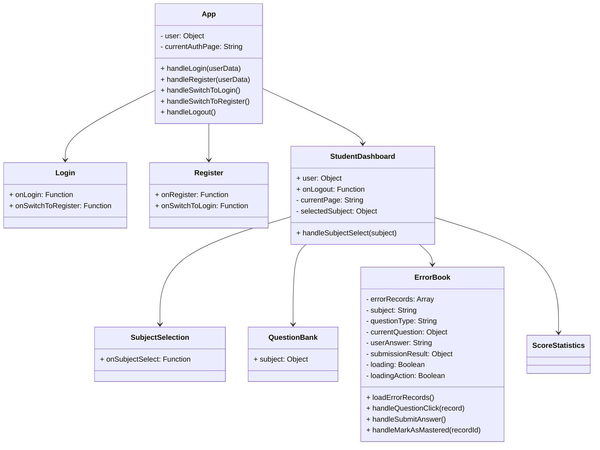
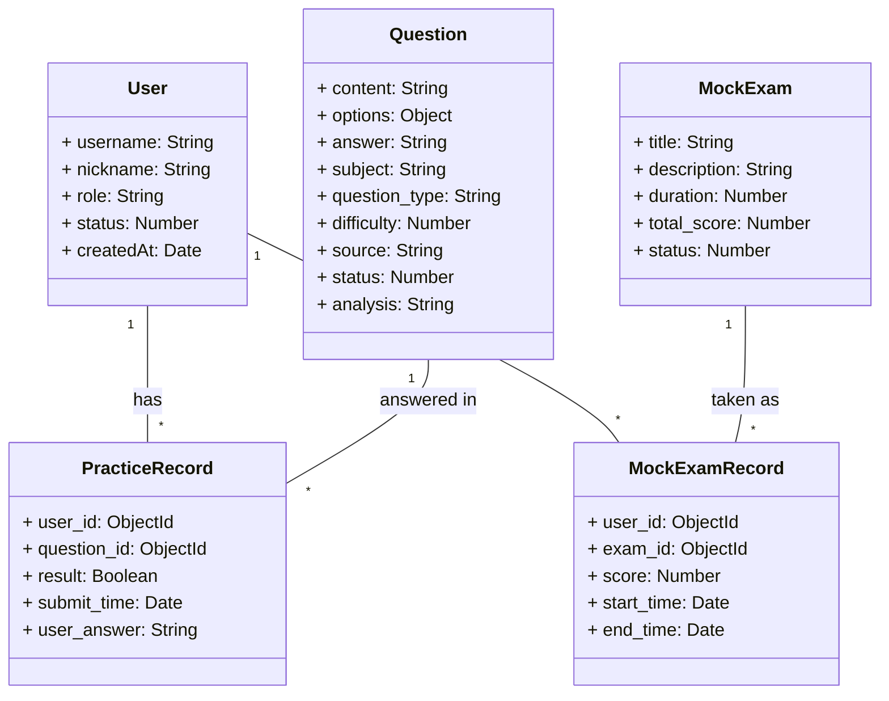
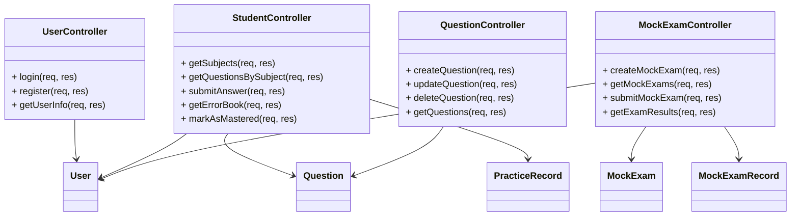
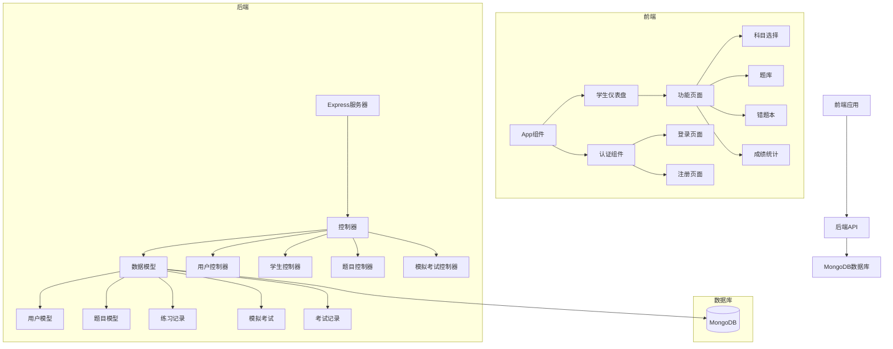

# 408考研刷题系统类图

## 前端组件关系

```mermaid
classDiagram
    class App {
        - user: Object
        - currentAuthPage: String
        + handleLogin(userData)
        + handleRegister(userData)
        + handleSwitchToLogin()
        + handleSwitchToRegister()
        + handleLogout()
    }
    
    class Login {
        + onLogin: Function
        + onSwitchToRegister: Function
    }
    
    class Register {
        + onRegister: Function
        + onSwitchToLogin: Function
    }
    
    class StudentDashboard {
        + user: Object
        + onLogout: Function
        - currentPage: String
        - selectedSubject: Object
        + handleSubjectSelect(subject)
    }
    
    class SubjectSelection {
        + onSubjectSelect: Function
    }
    
    class QuestionBank {
        + subject: Object
    }
    
    class ErrorBook {
        - errorRecords: Array
        - subject: String
        - questionType: String
        - currentQuestion: Object
        - userAnswer: String
        - submissionResult: Object
        - loading: Boolean
        - loadingAction: Boolean
        + loadErrorRecords()
        + handleQuestionClick(record)
        + handleSubmitAnswer()
        + handleMarkAsMastered(recordId)
    }
    
    class ScoreStatistics {
    }
    
    App --> Login
    App --> Register
    App --> StudentDashboard
    StudentDashboard --> SubjectSelection
    StudentDashboard --> QuestionBank
    StudentDashboard --> ErrorBook
    StudentDashboard --> ScoreStatistics
```

## 后端模型关系

```mermaid
classDiagram
    class User {
        + username: String
        + nickname: String
        + role: String
        + status: Number
        + createdAt: Date
    }
    
    class Question {
        + content: String
        + options: Object
        + answer: String
        + subject: String
        + question_type: String
        + difficulty: Number
        + source: String
        + status: Number
        + analysis: String
    }
    
    class PracticeRecord {
        + user_id: ObjectId
        + question_id: ObjectId
        + result: Boolean
        + submit_time: Date
        + user_answer: String
    }
    
    class MockExam {
        + title: String
        + description: String
        + duration: Number
        + total_score: Number
        + status: Number
    }
    
    class MockExamRecord {
        + user_id: ObjectId
        + exam_id: ObjectId
        + score: Number
        + start_time: Date
        + end_time: Date
    }
    
    User "1" -- "*" PracticeRecord: has
    User "1" -- "*" MockExamRecord: takes
    Question "1" -- "*" PracticeRecord: answered in
    MockExam "1" -- "*" MockExamRecord: taken as
```

## 后端控制器关系

```mermaid
classDiagram
    class UserController {
        + login(req, res)
        + register(req, res)
        + getUserInfo(req, res)
    }
    
    class StudentController {
        + getSubjects(req, res)
        + getQuestionsBySubject(req, res)
        + submitAnswer(req, res)
        + getErrorBook(req, res)
        + markAsMastered(req, res)
    }
    
    class QuestionController {
        + createQuestion(req, res)
        + updateQuestion(req, res)
        + deleteQuestion(req, res)
        + getQuestions(req, res)
    }
    
    class MockExamController {
        + createMockExam(req, res)
        + getMockExams(req, res)
        + submitMockExam(req, res)
        + getExamResults(req, res)
    }
    
    UserController --> User
    StudentController --> User
    StudentController --> Question
    StudentController --> PracticeRecord
    QuestionController --> Question
    MockExamController --> MockExam
    MockExamController --> MockExamRecord
    MockExamController --> User
```

## 系统架构

```mermaid
flowchart TD
    Frontend[前端应用] --> API[后端API]
    API --> Database[MongoDB数据库]
    
    subgraph 前端
        AppComponent[App组件]
        AuthComponents[认证组件]
        Dashboard[学生仪表盘]
        Pages[功能页面]
        
        AppComponent --> AuthComponents
        AppComponent --> Dashboard
        Dashboard --> Pages
        
        AuthComponents --> Login[登录页面]
        AuthComponents --> Register[注册页面]
        
        Pages --> SubjectSelection[科目选择]
        Pages --> QuestionBank[题库]
        Pages --> ErrorBook[错题本]
        Pages --> ScoreStatistics[成绩统计]
    end
    
    subgraph 后端
        Server[Express服务器]
        Controllers[控制器]
        Models[数据模型]
        
        Server --> Controllers
        Controllers --> Models
        
        Controllers --> UserController[用户控制器]
        Controllers --> StudentController[学生控制器]
        Controllers --> QuestionController[题目控制器]
        Controllers --> MockExamController[模拟考试控制器]
        
        Models --> User[用户模型]
        Models --> Question[题目模型]
        Models --> PracticeRecord[练习记录]
        Models --> MockExam[模拟考试]
        Models --> MockExamRecord[考试记录]
    end
    
    subgraph 数据库
        MongoDB[(MongoDB)]
    end
    
    Models --> MongoDB
```